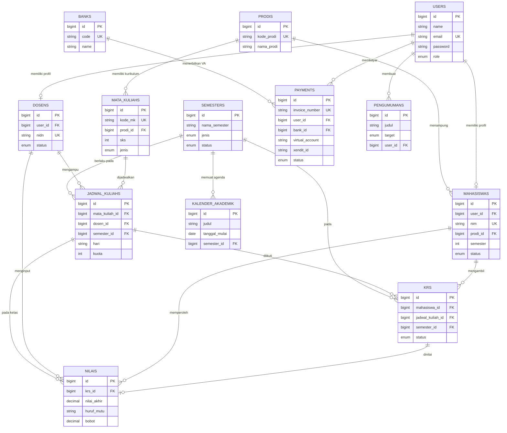
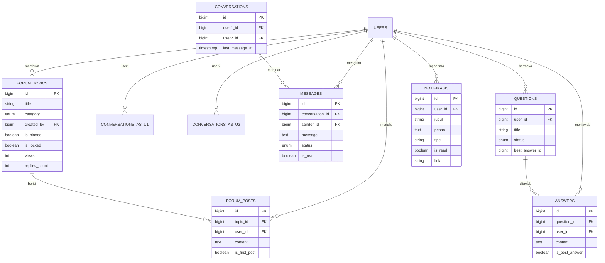
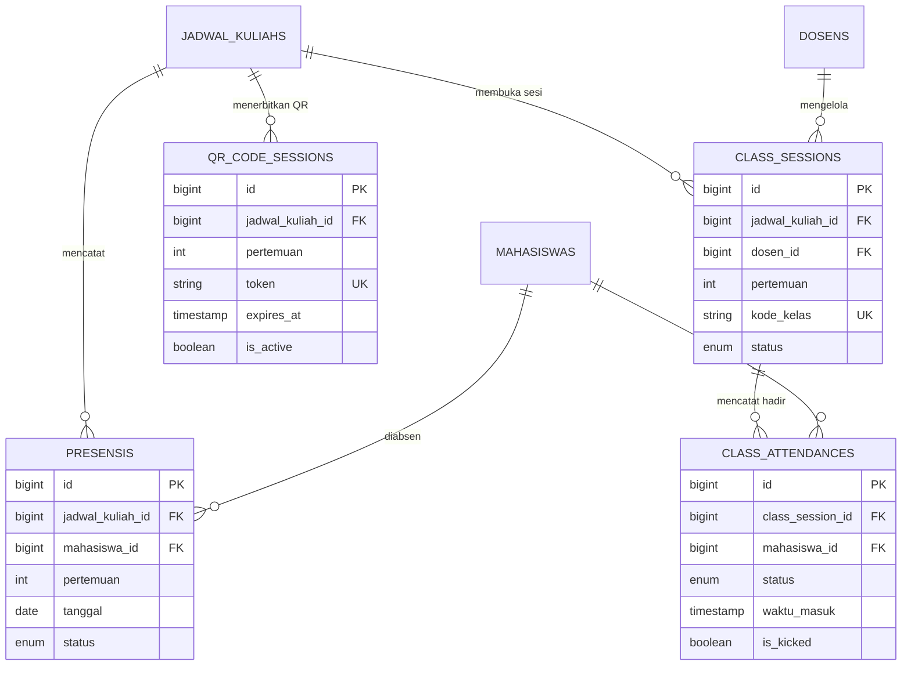
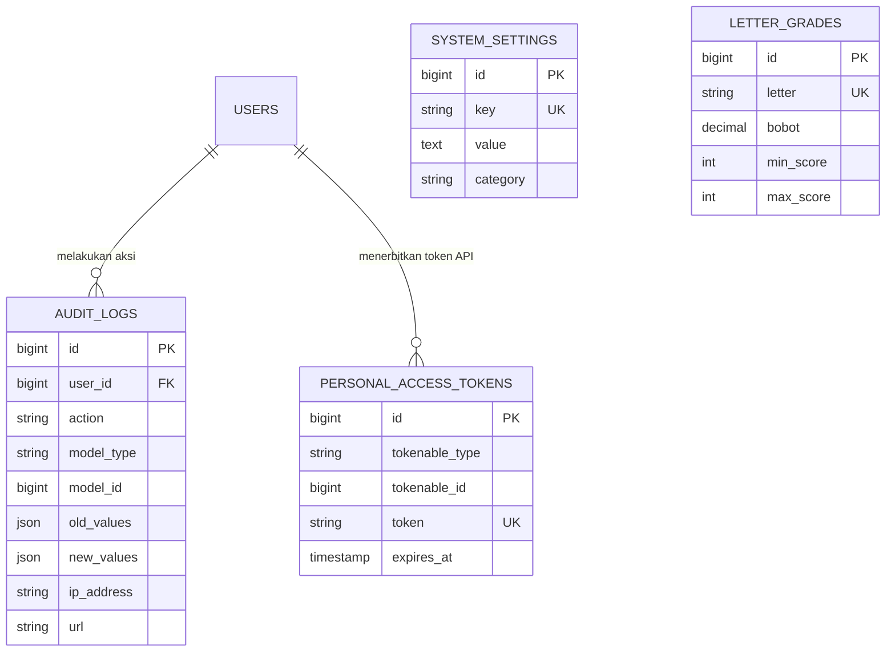

# Perancangan Basis Data / Entity Relationship Diagram (ERD)
## Lampiran Bab III — Sistem Informasi Akademik (SIAKAD) Institut Teknologi Al Mahrusiyah

Dokumen ini merupakan **lengkapi desain basis data** sesuai skema yang sudah diimplementasikan pada Laravel 11 (folder `database/migrations` dan `app/Models`). Diagram dan kamus data ini siap disalin ke Bab III bagian *Desain Pengembangan/Perancangan*.

---

## 1. Tujuan perancangan

Basis data SIAKAD dirancang tidak hanya untuk data akademik standar (mahasiswa, dosen, mata kuliah, KRS, nilai, dan pembayaran), tetapi juga untuk modul yang menopang pembelajaran daring dan tata kelola sistem, yaitu:

| Modul | Tabel utama | Fungsi |
| --- | --- | --- |
| Forum diskusi | `forum_topics`, `forum_posts` | Topik dan balasan komunitas kampus |
| Pesan / chat | `conversations`, `messages` | Percakapan privat antar pengguna |
| Tanya jawab | `questions`, `answers` | Thread Q&A terpisah dari forum |
| Notifikasi | `notifikasis` | Pemberitahuan in-app per pengguna |
| Log audit | `audit_logs` | Jejak aksi (login, ubah data, setujui KRS, dll.) |
| Tugas | `assignments`, `assignment_submissions` | Pemberian dan pengumpulan tugas |
| Presensi | `presensis`, `qr_code_sessions`, `class_sessions`, `class_attendances` | Absensi manual, QR, dan sesi kelas daring |
| Ujian daring | `exams`, `exam_questions`, `exam_sessions`, `exam_answers`, `exam_violation_rules` | Ujian online + aturan anti-kecurangan |

Perancangan ini mengikuti normalisasi hingga bentuk normal ketiga (3NF): setiap atribut non-kunci bergantung penuh pada kunci primer, dan ketergantungan transitif dihilangkan dengan memisahkan entitas (misalnya nilai ujian per soal disimpan di `exam_answers`, bukan diulang di `exams`). Integritas referensial dijaga melalui *foreign key* dan aturan `ON DELETE CASCADE` atau `SET NULL` sesuai kebutuhan bisnis.

---

## 2. Kelompok entitas

Sistem membagi entitas menjadi lima kelompok agar ERD tetap terbaca.

**A. Identitas dan master akademik.** `users`, `prodis`, `mahasiswas`, `dosens`, `semesters`, `mata_kuliahs`, `jadwal_kuliahs`, `krs`, `nilais`, `letter_grades`, `kalender_akademik`, `pengumumans`, `template_krs_khs`, `system_settings`.

**B. Pembayaran.** `banks`, `payments` (termasuk field integrasi Xendit: `xendit_id`, `external_id`, `xendit_response`).

**C. Komunikasi.** `conversations`, `messages`, `forum_topics`, `forum_posts`, `questions`, `answers`, `notifikasis`.

**D. Pembelajaran (presensi, tugas, ujian).** `presensis`, `qr_code_sessions`, `class_sessions`, `class_attendances`, `assignments`, `assignment_submissions`, `exams`, `exam_questions`, `exam_sessions`, `exam_answers`, `exam_violation_rules`.

**E. Keamanan dan sesi.** `audit_logs`, `sessions`, `password_reset_tokens`, `personal_access_tokens` (token API Sanctum).

---

## 3. Kardinalitas relasi (yang wajib ada di Bab 3)

| Relasi | Kardinalitas | Keterangan bisnis |
| --- | --- | --- |
| `users` — `mahasiswas` | 1 : 0..1 | Satu akun bernilai mahasiswa memiliki satu profil mahasiswa |
| `users` — `dosens` | 1 : 0..1 | Satu akun bernilai dosen memiliki satu profil dosen |
| `prodis` — `mahasiswas` | 1 : N | Satu prodi memiliki banyak mahasiswa |
| `prodis` — `mata_kuliahs` | 1 : N | Kurikulum mata kuliah milik prodi |
| `mata_kuliahs` — `jadwal_kuliahs` | 1 : N | Satu MK dapat dijadwalkan di banyak kelas/semester |
| `dosens` — `jadwal_kuliahs` | 1 : N | Dosen mengampu banyak jadwal |
| `semesters` — `jadwal_kuliahs` | 1 : N | Jadwal terikat semester aktif |
| `mahasiswas` — `krs` | 1 : N | Mahasiswa mengambil banyak baris KRS |
| `jadwal_kuliahs` — `krs` | 1 : N | Satu kelas diikuti banyak mahasiswa |
| `krs` — `nilais` | 1 : 0..1 | Nilai terikat pada KRS yang disetujui |
| `users` — `notifikasis` | 1 : N | Setiap notifikasi milik satu pengguna |
| `users` — `conversations` | 1 : N | Pengguna dapat terlibat di banyak percakapan (sebagai user1 atau user2) |
| `conversations` — `messages` | 1 : N | Satu percakapan berisi banyak pesan |
| `users` — `forum_topics` | 1 : N | Pengguna membuat banyak topik |
| `forum_topics` — `forum_posts` | 1 : N | Satu topik memiliki banyak posting |
| `users` — `audit_logs` | 1 : N (nullable) | Log tetap tersimpan jika akun dihapus (`SET NULL`) |
| `jadwal_kuliahs` — `presensis` | 1 : N | Absensi per pertemuan per mahasiswa |
| `jadwal_kuliahs` — `qr_code_sessions` | 1 : N | Token QR per pertemuan |
| `jadwal_kuliahs` — `class_sessions` | 1 : N | Sesi kelas daring (kode join) |
| `class_sessions` — `class_attendances` | 1 : N | Kehadiran mahasiswa di sesi |
| `jadwal_kuliahs` — `assignments` | 1 : N | Dosen menerbitkan tugas per kelas |
| `assignments` — `assignment_submissions` | 1 : N | Satu pengumpulan per mahasiswa per tugas (unik) |
| `jadwal_kuliahs` — `exams` | 1 : N | Ujian daring per kelas |
| `exams` — `exam_questions` | 1 : N | Bank soal ujian |
| `exams` — `exam_sessions` | 1 : N | Satu sesi pengerjaan per mahasiswa per ujian (unik) |
| `exam_sessions` — `exam_answers` | 1 : N | Jawaban per soal |
| `exams` — `exam_violation_rules` | 1 : 1 | Satu paket aturan anti-kecurangan per ujian |
| `users` — `payments` | 1 : N | Tagihan SPP/UKT milik pengguna |
| `banks` — `payments` | 1 : N | VA terhubung ke bank |

---

## 4. Diagram ERD per modul

Diagram berikut menggunakan notasi Crow’s Foot (Mermaid). Salin ke Word melalui alat seperti mermaid.live, draw.io, atau Visio.

### 4.1 ERD master akademik, KRS, nilai, dan pembayaran



### 4.2 ERD forum, pesan/chat, Q&A, dan notifikasi



Keterangan chat: satu baris `conversations` merepresentasikan pasangan unik dua pengguna (`unique user1_id, user2_id`). Status pesan adalah `sent`, `delivered`, atau `read`.

### 4.3 ERD presensi (manual, QR Code, dan sesi kelas)



`presensis` memakai kunci unik `(jadwal_kuliah_id, mahasiswa_id, pertemuan)` agar mahasiswa tidak tercatat dua kali pada pertemuan yang sama. `class_attendances` memakai kunci unik `(class_session_id, mahasiswa_id)`.

### 4.4 ERD tugas dan ujian daring

```mermaid
erDiagram
    JADWAL_KULIAHS ||--o{ ASSIGNMENTS : "memiliki tugas"
    DOSENS ||--o{ ASSIGNMENTS : "membuat"
    ASSIGNMENTS ||--o{ ASSIGNMENT_SUBMISSIONS : "dikumpulkan"
    MAHASISWAS ||--o{ ASSIGNMENT_SUBMISSIONS : "mengumpulkan"
    JADWAL_KULIAHS ||--o{ EXAMS : "memiliki ujian"
    DOSENS ||--o{ EXAMS : "menyusun"
    EXAMS ||--|| EXAM_VIOLATION_RULES : "mengatur anti-cheat"
    EXAMS ||--o{ EXAM_QUESTIONS : "berisi soal"
    EXAMS ||--o{ EXAM_SESSIONS : "dikerjakan"
    MAHASISWAS ||--o{ EXAM_SESSIONS : "mengikuti"
    EXAM_SESSIONS ||--o{ EXAM_ANSWERS : "menjawab"
    EXAM_QUESTIONS ||--o{ EXAM_ANSWERS : "dijawab pada"

    ASSIGNMENTS {
        bigint id PK
        bigint jadwal_kuliah_id FK
        bigint dosen_id FK
        string judul
        timestamp deadline
        int bobot
        enum status
    }
    ASSIGNMENT_SUBMISSIONS {
        bigint id PK
        bigint assignment_id FK
        bigint mahasiswa_id FK
        decimal nilai
        timestamp submitted_at
    }
    EXAMS {
        bigint id PK
        bigint jadwal_kuliah_id FK
        bigint dosen_id FK
        enum tipe
        int durasi
        boolean prevent_copy_paste
        boolean prevent_new_tab
        enum status
    }
    EXAM_VIOLATION_RULES {
        bigint id PK
        bigint exam_id FK UK
        int max_tab_switch_count
        int max_copy_paste_count
        boolean terminate_on_tab_switch_limit
    }
    EXAM_QUESTIONS {
        bigint id PK
        bigint exam_id FK
        enum tipe
        text pertanyaan
        json pilihan
        decimal bobot
    }
    EXAM_SESSIONS {
        bigint id PK
        bigint exam_id FK
        bigint mahasiswa_id FK
        int tab_switch_count
        json violations
        enum status
        decimal nilai
    }
    EXAM_ANSWERS {
        bigint id PK
        bigint exam_session_id FK
        bigint exam_question_id FK
        string jawaban_pilgan
        text jawaban_essay
        decimal nilai
    }
```

Log pelanggaran ujian disimpan sebagai JSON pada `exam_sessions.violations` (tipe, waktu, detail). Ambang batas penghentian ujian diatur di `exam_violation_rules`, bukan diulang per baris pelanggaran, agar aturan dapat diubah dosen tanpa migrasi skema.

### 4.5 ERD audit log dan pengaturan sistem



`audit_logs` bersifat *polymorphic* terhadap model Eloquent (`model_type` + `model_id`), sehingga satu tabel mencatat perubahan pada KRS, nilai, pembayaran, maupun master data tanpa membuat tabel log terpisah per modul.

---

## 5. Kamus data (data dictionary) — tabel yang diminta dosen

Kolom `id`, `created_at`, dan `updated_at` ada pada hampir semua tabel (kecuali `sessions` dan `password_reset_tokens`) dan tidak diulang di setiap baris.

### 5.1 Forum

**Tabel `forum_topics`**

| Atribut | Tipe | Ket. | Keterangan |
| --- | --- | --- | --- |
| id | BIGINT | PK | Identitas topik |
| title | VARCHAR | Wajib | Judul topik |
| description | TEXT | Null | Ringkasan |
| category | ENUM | Wajib | umum, akademik, organisasi, hobi, lainnya |
| created_by | BIGINT | FK → users | Pembuat topik |
| is_pinned | BOOLEAN | Default 0 | Disematkan di atas |
| is_locked | BOOLEAN | Default 0 | Ditutup dari balasan baru |
| views | INT | Default 0 | Jumlah dilihat |
| replies_count | INT | Default 0 | Jumlah balasan (denormalisasi hitungan) |
| last_reply_at | TIMESTAMP | Null | Waktu balasan terakhir |

**Tabel `forum_posts`**

| Atribut | Tipe | Ket. | Keterangan |
| --- | --- | --- | --- |
| id | BIGINT | PK | Identitas posting |
| topic_id | BIGINT | FK → forum_topics | Topik induk |
| user_id | BIGINT | FK → users | Penulis |
| content | TEXT | Wajib | Isi posting |
| is_first_post | BOOLEAN | Default 0 | True jika posting pembuka (OP) |

### 5.2 Pesan / chat

**Tabel `conversations`**

| Atribut | Tipe | Ket. | Keterangan |
| --- | --- | --- | --- |
| id | BIGINT | PK | Identitas percakapan |
| user1_id | BIGINT | FK → users | Peserta pertama |
| user2_id | BIGINT | FK → users | Peserta kedua |
| last_message_at | TIMESTAMP | Null | Untuk urutan daftar chat |
| UNIQUE | (user1_id, user2_id) | | Satu thread per pasangan pengguna |

**Tabel `messages`**

| Atribut | Tipe | Ket. | Keterangan |
| --- | --- | --- | --- |
| id | BIGINT | PK | Identitas pesan |
| conversation_id | BIGINT | FK → conversations | Thread |
| sender_id | BIGINT | FK → users | Pengirim |
| message | TEXT | Wajib | Isi pesan |
| status | ENUM | Default sent | sent, delivered, read |
| is_read | BOOLEAN | Default 0 | Tandai dibaca |
| read_at | TIMESTAMP | Null | Waktu dibaca |

### 5.3 Notifikasi

**Tabel `notifikasis`**

| Atribut | Tipe | Ket. | Keterangan |
| --- | --- | --- | --- |
| id | BIGINT | PK | Identitas notifikasi |
| user_id | BIGINT | FK → users | Penerima |
| judul | VARCHAR | Wajib | Judul singkat |
| pesan | TEXT | Wajib | Isi |
| tipe | VARCHAR | Default info | info, success, warning, error |
| link | VARCHAR | Null | URL tujuan (KRS, nilai, ujian, dll.) |
| is_read | BOOLEAN | Default 0 | Status baca |

### 5.4 Log audit

**Tabel `audit_logs`**

| Atribut | Tipe | Ket. | Keterangan |
| --- | --- | --- | --- |
| id | BIGINT | PK | Identitas log |
| user_id | BIGINT | FK → users, SET NULL | Pelaku; null jika akun dihapus |
| action | VARCHAR | Wajib | create, update, delete, login, logout, approve, reject, dll. |
| model_type | VARCHAR | Null | Nama kelas Eloquent |
| model_id | BIGINT | Null | PK record yang diubah |
| old_values | JSON | Null | Snapshot sebelum ubah |
| new_values | JSON | Null | Snapshot sesudah ubah |
| description | TEXT | Null | Uraian aksi |
| ip_address | VARCHAR(45) | Null | IPv4/IPv6 |
| user_agent | TEXT | Null | Peramban/perangkat |
| url | VARCHAR | Null | Endpoint saat aksi |

### 5.5 Tugas

**Tabel `assignments`**

| Atribut | Tipe | Ket. | Keterangan |
| --- | --- | --- | --- |
| id | BIGINT | PK | Identitas tugas |
| jadwal_kuliah_id | BIGINT | FK → jadwal_kuliahs | Kelas tujuan |
| dosen_id | BIGINT | FK → dosens | Pembuat |
| judul | VARCHAR | Wajib | Nama tugas |
| deskripsi | TEXT | Null | Instruksi |
| file_path | VARCHAR | Null | Lampiran soal |
| deadline | TIMESTAMP | Wajib | Batas kumpul |
| bobot | INT | Default 0 | Bobot 0–100 terhadap nilai |
| status | ENUM | Default draft | draft, published, closed |

**Tabel `assignment_submissions`**

| Atribut | Tipe | Ket. | Keterangan |
| --- | --- | --- | --- |
| id | BIGINT | PK | Identitas pengumpulan |
| assignment_id | BIGINT | FK → assignments | Tugas |
| mahasiswa_id | BIGINT | FK → mahasiswas | Pengumpul |
| jawaban | TEXT | Null | Jawaban teks |
| file_path | VARCHAR | Null | File unggahan |
| nilai | DECIMAL(5,2) | Null | Nilai dosen |
| feedback | TEXT | Null | Komentar dosen |
| submitted_at | TIMESTAMP | Null | Waktu kumpul |
| UNIQUE | (assignment_id, mahasiswa_id) | | Satu pengumpulan per mahasiswa |

### 5.6 Presensi

**Tabel `presensis`** (absensi per pertemuan, termasuk hasil scan QR)

| Atribut | Tipe | Ket. | Keterangan |
| --- | --- | --- | --- |
| id | BIGINT | PK | Identitas absensi |
| jadwal_kuliah_id | BIGINT | FK | Kelas |
| mahasiswa_id | BIGINT | FK | Mahasiswa |
| pertemuan | INT | Wajib | Pertemuan ke-n |
| tanggal | DATE | Wajib | Tanggal kuliah |
| status | ENUM | Default alpa | hadir, izin, sakit, alpa |
| catatan | TEXT | Null | Keterangan |
| UNIQUE | (jadwal, mahasiswa, pertemuan) | | Cegah absen ganda |

**Tabel `qr_code_sessions`**

| Atribut | Tipe | Ket. | Keterangan |
| --- | --- | --- | --- |
| id | BIGINT | PK | Identitas sesi QR |
| jadwal_kuliah_id | BIGINT | FK | Kelas |
| pertemuan | INT | Wajib | Pertemuan |
| tanggal | DATE | Wajib | Tanggal |
| token | VARCHAR(100) | UK | Isi QR |
| expires_at | TIMESTAMP | Wajib | Kadaluarsa |
| is_active | BOOLEAN | Default 1 | Dapat dipindai |
| duration_minutes | INT | Default 30 | Durasi valid |

**Tabel `class_sessions` dan `class_attendances`**

Sesi kelas daring memakai `kode_kelas` unik (8 karakter). Kehadiran di sesi mencatat `waktu_masuk`, `waktu_keluar`, serta opsi mengeluarkan mahasiswa (`is_kicked`, `kicked_at`, `alasan_kick`). Status: hadir, izin, sakit, alpa, dikeluarkan.

### 5.7 Ujian daring

**Tabel `exams`**

| Atribut | Tipe | Ket. | Keterangan |
| --- | --- | --- | --- |
| id | BIGINT | PK | Identitas ujian |
| jadwal_kuliah_id | BIGINT | FK | Kelas |
| dosen_id | BIGINT | FK | Penyusun |
| judul | VARCHAR | Wajib | Nama ujian |
| tipe | ENUM | Default pilgan | pilgan, essay, campuran |
| durasi | INT | Wajib | Menit |
| mulai / selesai | TIMESTAMP | selesai wajib | Jendela waktu |
| total_soal | INT | Default 0 | Jumlah soal |
| bobot | DECIMAL(5,2) | Default 0 | Bobot ke nilai akhir |
| random_soal / random_pilihan | BOOLEAN | Default 0 | Pengacakan |
| prevent_copy_paste | BOOLEAN | Default 1 | Blok salin-tempel |
| prevent_new_tab | BOOLEAN | Default 1 | Deteksi pindah tab |
| fullscreen_mode | BOOLEAN | Default 1 | Paksa layar penuh |
| status | ENUM | Default draft | draft, published, ongoing, finished |

**Tabel `exam_questions`:** `tipe` (pilgan/essay), `pertanyaan`, `pilihan` (JSON), `jawaban_benar`, `jawaban_benar_essay`, `bobot`, `urutan`, `penjelasan`.

**Tabel `exam_sessions`:** unik `(exam_id, mahasiswa_id)`; `waktu_tersisa` (detik); `tab_switch_count`; `copy_paste_attempt_count`; `violations` (JSON); status `started`, `submitted`, `auto_submitted`, `terminated`; `nilai`.

**Tabel `exam_answers`:** unik `(exam_session_id, exam_question_id)`; `jawaban_pilgan`, `jawaban_essay`, `nilai`, `feedback`, `is_answered`.

**Tabel `exam_violation_rules`:** satu baris per ujian (unik `exam_id`); berisi ambang tab switch, copy-paste, window blur, keluar fullscreen, deteksi multi-perangkat, serta pesan peringatan/penghentian.

---

## 6. Daftar lengkap tabel vs model Laravel

| Tabel | Model | Sudah ada di kode |
| --- | --- | --- |
| users | User | Ya |
| prodis | Prodi | Ya |
| mahasiswas | Mahasiswa | Ya |
| dosens | Dosen | Ya |
| semesters | Semester | Ya |
| mata_kuliahs | MataKuliah | Ya |
| jadwal_kuliahs | JadwalKuliah | Ya |
| krs | KRS | Ya |
| nilais | Nilai | Ya |
| pengumumans | Pengumuman | Ya |
| notifikasis | Notifikasi | Ya |
| conversations | Conversation | Ya |
| messages | Message | Ya |
| forum_topics | ForumTopic | Ya |
| forum_posts | ForumPost | Ya |
| questions | Question | Ya |
| answers | Answer | Ya |
| banks | Bank | Ya |
| payments | Payment | Ya |
| presensis | Presensi | Ya |
| qr_code_sessions | QrCodeSession | Ya |
| class_sessions | ClassSession | Ya |
| class_attendances | ClassAttendance | Ya |
| assignments | Assignment | Ya |
| assignment_submissions | AssignmentSubmission | Ya |
| exams | Exam | Ya |
| exam_questions | ExamQuestion | Ya |
| exam_sessions | ExamSession | Ya |
| exam_answers | ExamAnswer | Ya |
| exam_violation_rules | ExamViolationRule | Ya |
| audit_logs | AuditLog | Ya |
| kalender_akademik | KalenderAkademik | Ya |
| letter_grades | LetterGrade | Ya |
| system_settings | SystemSetting | Ya |
| template_krs_khs | TemplateKrsKhs | Ya |
| personal_access_tokens | (Sanctum) | Ya |
| sessions, password_reset_tokens, jobs, cache | (framework) | Ya |

Tidak perlu membuat tabel baru untuk forum, chat, notifikasi, audit, tugas, presensi, atau ujian: semuanya sudah dimigrasikan. Yang dilengkapi pada revisi ini adalah **dokumentasi ERD + kamus data** (untuk Bab 3) dan **kunci unik** pada `class_attendances` serta `exam_violation_rules` agar relasi 1 mahasiswa per sesi dan 1 aturan per ujian terjaga di level basis data.

---

## 7. Paragraf siap tempel ke Bab III (bagian Desain Basis Data)

Salin blok berikut ke Word, lalu sisipkan gambar ERD hasil ekspor dari bagian 4.

> Perancangan basis data SIAKAD menggunakan MySQL dengan pendekatan Entity Relationship Diagram (ERD) dan normalisasi hingga bentuk normal ketiga. Entitas dikelompokkan menjadi data master akademik, data transaksional akademik, data komunikasi, data pembelajaran daring, data pembayaran, serta data keamanan. Data master mencakup `users`, `prodis`, `mahasiswas`, `dosens`, `semesters`, `mata_kuliahs`, dan `jadwal_kuliahs`. Data transaksional akademik mencakup `krs` dan `nilais`, dengan relasi mahasiswa–jadwal bersifat many-to-many melalui `krs` dan constraint unik agar mahasiswa tidak mengambil kelas yang sama dua kali pada satu semester.
>
> Untuk menampung fitur berskala besar yang sudah menjadi bagian sistem, ditambahkan relasi forum (`forum_topics`, `forum_posts`), pesan privat (`conversations`, `messages`), tanya jawab (`questions`, `answers`), dan notifikasi per pengguna (`notifikasis`). Jejak aktivitas disimpan pada `audit_logs` secara polimorfik (`model_type` dan `model_id`) beserta nilai lama dan baru dalam format JSON, sehingga perubahan KRS, nilai, maupun pembayaran dapat ditelusuri tanpa tabel log terpisah.
>
> Modul pembelajaran daring direpresentasikan secara terpisah dari nilai akhir. Tugas kuliah disimpan pada `assignments` dan pengumpulan mahasiswa pada `assignment_submissions` dengan unik pasangan tugas–mahasiswa. Presensi memakai `presensis` (satu baris per pertemuan per mahasiswa), `qr_code_sessions` untuk token QR berkadaluarsa, serta `class_sessions` dan `class_attendances` untuk kehadiran berbasis kode kelas. Ujian daring memakai `exams`, `exam_questions`, `exam_sessions`, dan `exam_answers`; aturan anti-kecurangan (batas pindah tab, salin-tempel, keluar layar penuh) disimpan pada `exam_violation_rules` dengan relasi satu-ke-satu terhadap ujian, sedangkan rincian pelanggaran per mahasiswa disimpan pada kolom JSON `exam_sessions.violations`.
>
> Integritas data dijaga melalui foreign key, penghapusan berjenjang pada data anak yang tidak bermakna tanpa induk (misalnya pesan ikut terhapus jika percakapan dihapus), dan `SET NULL` pada `audit_logs.user_id` agar histori tetap ada meskipun akun dihapus. Pembayaran terhubung ke `banks` dan `payments` termasuk identitas transaksi Xendit. Dengan rancangan ini, pengodean pada Laravel 11 melalui Eloquent ORM tidak menemui jalan buntu karena setiap modul sudah memiliki tabel dan relasi yang sesuai sebelum implementasi fitur.

---

## 8. Cara menggambar di Visio / draw.io

1. Buat lima halaman diagram sesuai bagian 4.1–4.5 (jangan dipaksa satu kanvas agar tetap terbaca di kertas A4 landscape).
2. Shape: persegi panjang = entitas; elips atau daftar atribut di dalam kotak; garis dengan Crow’s Foot untuk 1:N; garis dengan dua ujung “satu” untuk 1:1 (`exams`–`exam_violation_rules`).
3. Tandai PK dengan garis bawah dan FK dengan label `FK`.
4. Pada Bab 3, tulis keterangan: “Gambar x.x ERD Modul Komunikasi; Gambar x.x ERD Modul Pembelajaran Daring,” dst.
5. Ekspor PNG/SVG lalu sisipkan ke Word.

File pendukung alur proses (bukan ERD) tetap ada di `docs/flowchart-visio/`.
