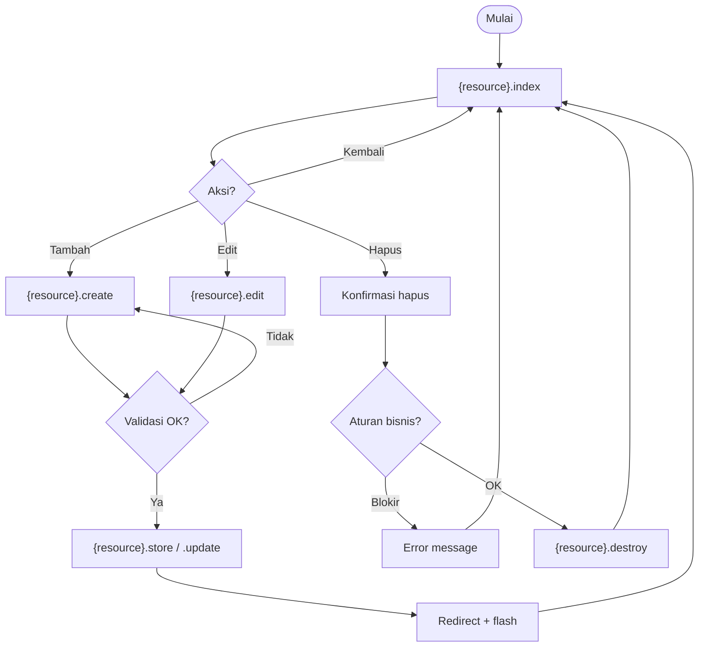

# Template CRUD (duplikasi di Visio)

**Page Visio:** salin untuk ADM-02, ADM-03, ADM-04, ADM-05, ADM-06, ADM-07, ADM-08, ADM-10, ADM-13, ADM-11 (sebagian)

Ganti `{resource}` dengan nama route resource (contoh: `admin.prodi`).

## Shape mapping

| # | Shape | Label Process | Route |
|---|-------|---------------|-------|
| 1 | Terminator | Mulai | — |
| 2 | Process | Daftar data | `{resource}.index` |
| 3 | Decision | Aksi user? | — |
| 4 | Process | Form tambah | `{resource}.create` |
| 5 | Process | Form edit | `{resource}.edit` |
| 6 | Process | Konfirmasi hapus | `{resource}.destroy` |
| 7 | Decision | Validasi OK? | — |
| 8 | Process | Simpan create | `{resource}.store` |
| 9 | Process | Simpan update | `{resource}.update` |
| 10 | Decision | Aturan bisnis OK? | — |
| 11 | Process | Hapus record | `{resource}.destroy` |
| 12 | Process | Flash sukses | redirect `{resource}.index` |
| 13 | Terminator | Selesai | — |

## Decision khusus per modul

| Page | Resource routes | Decision tambahan |
|------|-----------------|-------------------|
| ADM-02 | `admin.admin.*` | Hapus: `user_id != auth()->id()` |
| ADM-04 | `admin.mahasiswa.*` | Transaksi User + Mahasiswa |
| ADM-05 | `admin.dosen.*` | Transaksi User + Dosen |
| ADM-07 | `admin.semester.*` | Set aktif → nonaktifkan semester lain |
| ADM-08 | `admin.jadwal-kuliah.*` | Create: `terisi = 0` |
| ADM-10 | `admin.pengumuman.*` | Setelah store: notifikasi by `target` |
| ADM-11 | `admin.template-krs-khs.*` | Toggle: satu aktif per `jenis` |
