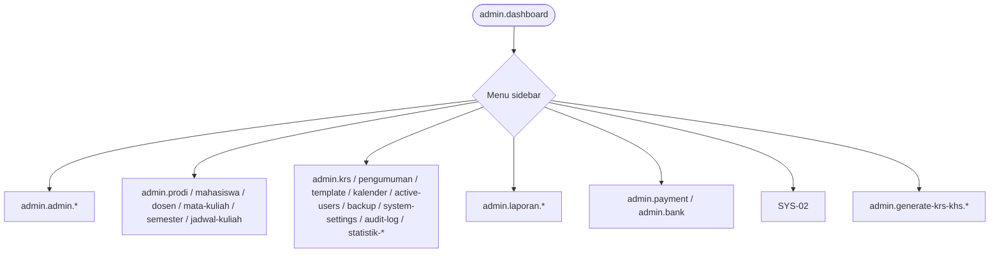

# ADM-00 — Navigasi Admin

**Route gate:** `admin.dashboard` + middleware `role:admin`

| Menu sidebar | Route utama |
|--------------|-------------|
| Dashboard | `admin.dashboard` |
| Admin users | `admin.admin.index` |
| Prodi | `admin.prodi.index` |
| Mahasiswa | `admin.mahasiswa.index` |
| Dosen | `admin.dosen.index` |
| Mata kuliah | `admin.mata-kuliah.index` |
| Semester | `admin.semester.index` |
| Jadwal kuliah | `admin.jadwal-kuliah.index` |
| KRS | `admin.krs.index` |
| Pengumuman | `admin.pengumuman.index` |
| Template KRS/KHS | `admin.template-krs-khs.index` |
| Kalender | `admin.kalender-akademik.index` |
| Pengguna aktif | `admin.active-users.index` |
| Backup | `admin.backup.index` |
| Pengaturan | `admin.system-settings.index` |
| Audit log | `admin.audit-log.index` |
| Statistik presensi | `admin.statistik-presensi.index` |
| Statistik per prodi | `admin.statistik-presensi-per-prodi.index` |
| Laporan pembayaran | `admin.laporan.pembayaran.index` |
| Laporan akademik | `admin.laporan.akademik.index` |
| Pembayaran | `admin.payment.index` |
| Bank | `admin.bank.index` |
| Generate KRS/KHS | `admin.generate-krs-khs.index` (tidak di sidebar) |
| Komunikasi | `notifikasi.*`, `chat.*`, `forum.*`, `qna.*`, `profile.*` |

