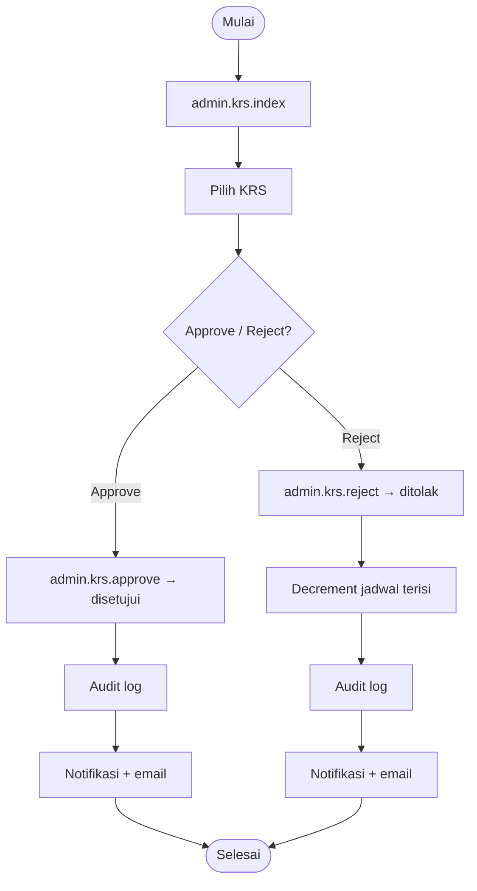

# ADM-09 — Persetujuan KRS

| Shape | Route |
|-------|-------|
| Terminator | Mulai |
| Process | `admin.krs.index` |
| Process | Pilih KRS pending |
| Decision | Approve atau Reject? |
| Process | `admin.krs.approve` |
| Process | `admin.krs.reject` |
| Terminator | Selesai |

**Off-page:** [X-01](../cross/X-01.md)
