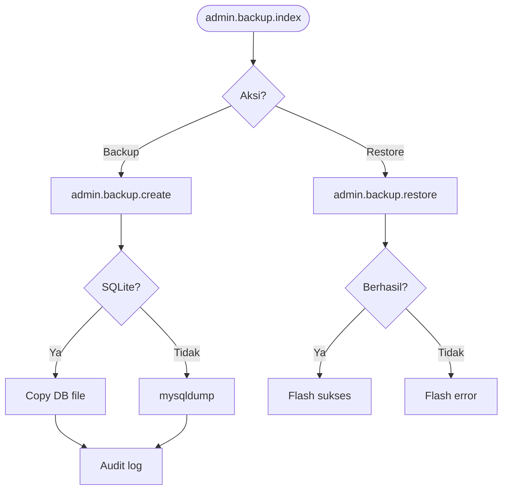

# ADM-15 — Backup & Restore

| Shape | Route |
|-------|-------|
| Process | `admin.backup.index` |
| Decision | Aksi? Backup / Restore |
| Process | `admin.backup.create` |
| Decision | DB SQLite? |
| Process | Copy file / mysqldump |
| Process | `admin.backup.download` |
| Process | `admin.backup.restore` |
| Process | `admin.backup.destroy` |

