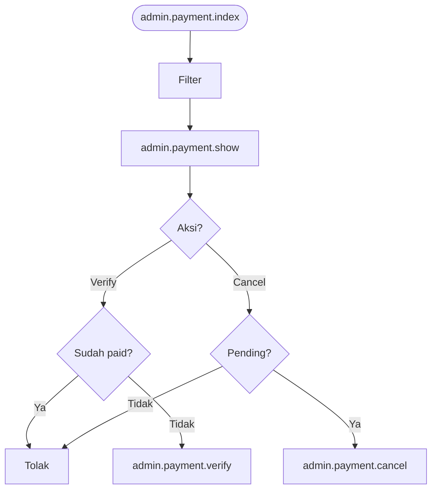

# ADM-22 — Pembayaran Admin & Bank

## Pembayaran

| Shape | Route |
|-------|-------|
| Process | `admin.payment.index` |
| Process | `admin.payment.show` |
| Process | Auto-expire on show |
| Decision | Verify? |
| Process | `admin.payment.verify` |
| Decision | Cancel? status pending? |
| Process | `admin.payment.cancel` |
| Process | `admin.payment.statistics` (JSON) |

## Bank

| Route |
|-------|
| `admin.bank.index` |
| `admin.bank.edit` |
| `admin.bank.update` |
| `admin.bank.toggle-status` |

**Off-page:** [X-04](../cross/X-04.md)
