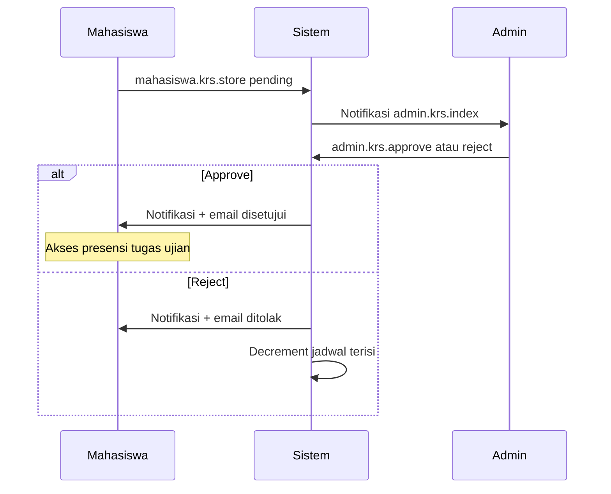

# X-01 — Siklus KRS (Mahasiswa → Admin)

**Visio page:** `X-01` — gunakan **Cross-Functional Flowchart** (3 swimlane)

## Swimlane: Mahasiswa

| Shape | Route |
|-------|-------|
| Process | `mahasiswa.krs.index` |
| Process | `mahasiswa.krs.create` |
| Process | `mahasiswa.krs.store` → status `pending`, `terisi++` |
| Process | `mahasiswa.krs.destroy` → `terisi--` |
| Document | `mahasiswa.export.krs` (jika `disetujui`) |

## Swimlane: Sistem

| Shape | Aksi |
|-------|------|
| Process | Notifikasi ke admin |
| Process | Badge sidebar `pendingKrsCount` |
| Process | Email + notifikasi ke mahasiswa (setelah approve/reject) |

## Swimlane: Admin

| Shape | Route |
|-------|-------|
| Process | `admin.krs.index` |
| Process | `admin.krs.approve` → `disetujui` |
| Process | `admin.krs.reject` → `ditolak`, `terisi--` |

**Off-page:** [MHS-02](../mahasiswa/MHS-02.md), [ADM-09](../admin/ADM-09.md)
