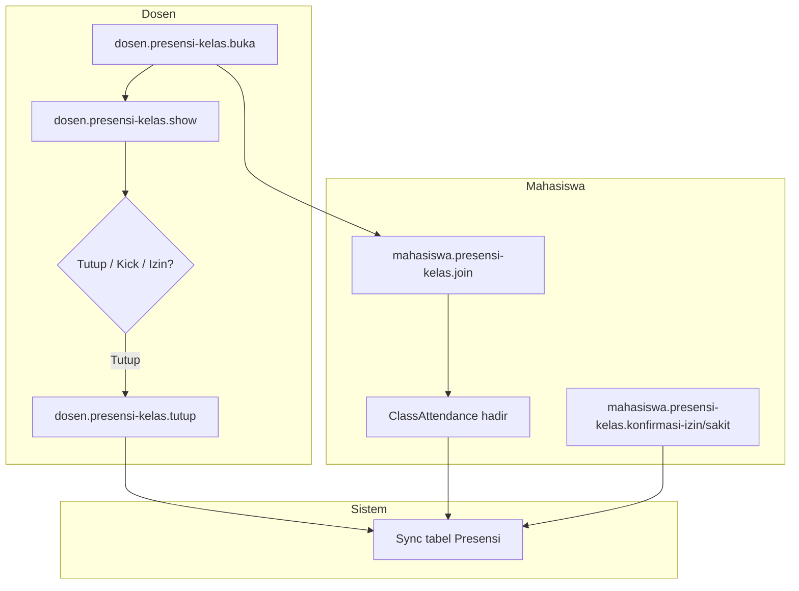

# X-02 — Presensi Kelas (Dosen ↔ Mahasiswa)

**Visio page:** `X-02` — swimlane: **Dosen** | **Mahasiswa** | **Sistem**

## Dosen

| Shape | Route |
|-------|-------|
| Process | `dosen.presensi-kelas.index` |
| Process | `dosen.presensi-kelas.buka` |
| Process | `dosen.presensi-kelas.show` |
| Process | `dosen.presensi-kelas.peserta` (JSON) |
| Process | `dosen.presensi-kelas.tutup` |
| Process | `dosen.presensi-kelas.kick` |
| Process | `dosen.presensi-kelas.update-status` |

## Mahasiswa

| Shape | Route |
|-------|-------|
| Process | `mahasiswa.presensi-kelas.index` |
| Process | `mahasiswa.presensi-kelas.join` |
| Process | `mahasiswa.presensi-kelas.history` |
| Process | `mahasiswa.presensi-kelas.konfirmasi-izin` |
| Process | `mahasiswa.presensi-kelas.konfirmasi-sakit` |

## Sistem (sync)

| Shape | Aksi |
|-------|------|
| Stored Data | `class_sessions`, `class_attendances`, `presensi` |
| Process | Sync `Presensi` saat tutup / kick / update-status / join |

**Off-page:** [DSN-04](../dosen/DSN-04.md), [MHS-08](../mahasiswa/MHS-08.md)
