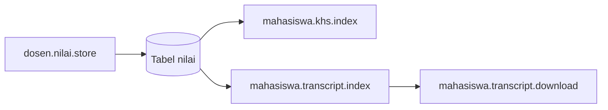

# X-03 — Nilai (Dosen → Mahasiswa KHS)

**Visio page:** `X-03`

## Dosen (input)

| Shape | Route |
|-------|-------|
| Process | `dosen.nilai.index` |
| Process | `dosen.nilai.create` |
| Process | `dosen.nilai.store` |
| Process | `dosen.nilai.edit` |
| Process | `dosen.nilai.update` |

**Business:** Nilai akhir = 30% tugas + 30% UTS + 40% UAS; huruf A–E; notifikasi jika record baru.

## Mahasiswa (baca)

| Shape | Route |
|-------|-------|
| Process | `mahasiswa.khs.index` |
| Process | `mahasiswa.export.khs` |
| Process | `mahasiswa.transcript.index` |
| Document | `mahasiswa.transcript.download` |

**Off-page:** [DSN-02](../dosen/DSN-02.md), [MHS-03](../mahasiswa/MHS-03.md), [MHS-04](../mahasiswa/MHS-04.md)
