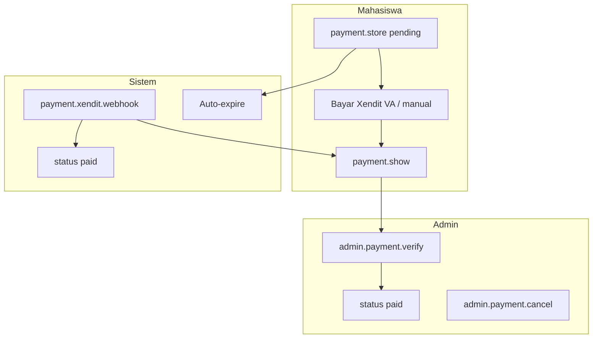

# X-04 — Pembayaran (Mahasiswa → Admin / Xendit)

**Visio page:** `X-04` — swimlane: **Mahasiswa** | **Sistem** | **Admin**

## Mahasiswa

| Shape | Route |
|-------|-------|
| Process | `payment.index` |
| Process | `payment.create` |
| Process | `payment.store` |
| Process | `payment.show` |
| Process | `payment.cancel` |

## Sistem

| Shape | Route / aksi |
|-------|----------------|
| Process | `payment.xendit.webhook` (public) |
| Process | Auto-expire 24 jam |
| Stored Data | Tabel `payments` |

## Admin

| Shape | Route |
|-------|-------|
| Process | `admin.payment.index` |
| Process | `admin.payment.show` |
| Process | `admin.payment.verify` |
| Process | `admin.payment.cancel` |
| Process | `payment.verify` (route global + middleware admin) |

**Off-page:** [MHS-13](../mahasiswa/MHS-13.md), [ADM-22](../admin/ADM-22.md)
