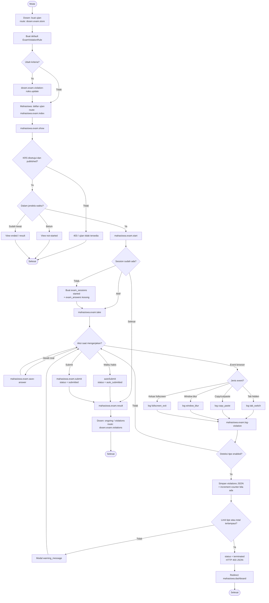

# X-05 — Ujian Anti-Cheat (Dosen ↔ Mahasiswa ↔ Sistem)

**Visio page:** `X-05` — gunakan **Cross-Functional Flowchart** (3 swimlane: **Dosen** | **Sistem** | **Mahasiswa**)

Alur proctoring ujian: dosen mengatur aturan pelanggaran, mahasiswa mengerjakan di halaman `take`, browser mengirim log, server memutuskan **peringatan** atau **terminate**.

## Swimlane: Dosen

| # | Shape | Label | Route |
|---|-------|-------|-------|
| 1 | Terminator | Mulai | — |
| 2 | Process | Buat ujian + flag anti-cheat | `dosen.exam.store` |
| 3 | Process | Atur kriteria pelanggaran | `dosen.exam.violation-rules` |
| 4 | Process | Simpan aturan | `dosen.exam.violation-rules.update` |
| 5 | Process | Monitor ujian berlangsung | `dosen.exam.ongoing` |
| 6 | Process | Mahasiswa aktif | `dosen.exam.active-students` |
| 7 | Process | Daftar pelanggaran per ujian | `dosen.exam.violations` |
| 8 | Process | Detail session | `dosen.exam.violation-detail` |
| 9 | Process | Semua pelanggaran | `dosen.exam.all-violations` |
| 10 | Off-page | Kelola soal / nilai | → [DSN-09a](../dosen/DSN-09a.md), [DSN-09b](../dosen/DSN-09b.md) |

Flag di tabel `exams` saat store/update:

| Flag | Efek di halaman `take` |
|------|------------------------|
| `prevent_copy_paste` | Blok copy/cut/paste/context menu + log `copy_paste` |
| `prevent_new_tab` | Deteksi `visibilitychange` (`tab_switch`) dan `window.blur` (`window_blur`) |
| `fullscreen_mode` | Wajib fullscreen; keluar → log `fullscreen_exit` |

## Swimlane: Sistem

| Shape | Aksi |
|-------|------|
| Stored Data | `exams`, `exam_violation_rules`, `exam_sessions`, `exam_answers` |
| Process | Saat `dosen.exam.store`: buat `ExamViolationRule` default |
| Process | `mahasiswa.exam.log-violation`: cek enable, increment counter, `addViolation()` |
| Decision | Melewati limit tipe **atau** total pelanggaran? |
| Process | Ya → `status = terminated`, HTTP 403 JSON |
| Process | Tidak → JSON warning + sisa kuota |
| Process | Waktu habis di `take` → `autoSubmit` → `status = auto_submitted` |
| Process | Submit manual → hitung nilai pilgan → `status = submitted` |

## Swimlane: Mahasiswa

| # | Shape | Label | Route |
|---|-------|-------|-------|
| 1 | Process | Daftar ujian | `mahasiswa.exam.index` |
| 2 | Process | Detail ujian | `mahasiswa.exam.show` |
| 3 | Decision | KRS disetujui + status `published` + jendela waktu? | — |
| 4 | Process | Buat / lanjut session | `mahasiswa.exam.start` |
| 5 | Process | Kerjakan soal (fullscreen jika wajib) | `mahasiswa.exam.take` |
| 6 | Process | Simpan jawaban AJAX | `mahasiswa.exam.save-answer` |
| 7 | Data | Event browser: tab / copy / blur / fullscreen | JS di `take.blade.php` |
| 8 | Process | Kirim log pelanggaran | `mahasiswa.exam.log-violation` |
| 9 | Decision | Server `terminated: true`? | — |
| 10 | Process | Redirect dashboard | `mahasiswa.dashboard` |
| 11 | Process | Submit | `mahasiswa.exam.submit` |
| 12 | Process | Hasil | `mahasiswa.exam.result` |
| 13 | Terminator | Selesai | — |

## Decision: jenis pelanggaran → terminate?

`violation_type` yang diterima server: `tab_switch` | `copy_paste` | `window_blur` | `fullscreen_exit`

```
Deteksi enabled untuk tipe ini?
  Tidak → JSON success:false, session tetap started
  Ya → catat ke exam_sessions.violations (JSON) + user_agent
       tab_switch → increment tab_switch_count
       copy_paste → increment copy_paste_attempt_count
       window_blur / fullscreen_exit → hanya array violations (tanpa kolom counter)

Counter tipe > max  DAN  terminate_on_*_limit = true?
  Ya → shouldTerminate = true

enable_time_based_termination  DAN  count(violations) >= max_violations_before_termination?
  Ya → shouldTerminate = true

shouldTerminate?
  Ya → status terminated, finished_at = now, redirect dashboard
  Tidak → modal peringatan (warning_message)
```

**Default aturan** (`ExamViolationRule::getDefaults()`):

| Kriteria | Enable | Max | Terminate on limit |
|----------|--------|-----|--------------------|
| Tab switch | ya | 3 | ya |
| Copy-paste | ya | 3 | ya |
| Window blur | ya | 5 | tidak |
| Fullscreen exit | ya | 3 | ya |
| Multiple device | tidak | — | ya (flag ada; **belum** dikirim dari `log-violation`) |
| Total pelanggaran | ya (`enable_time_based_termination`) | 3 | ya |

Status session: `started` → `submitted` | `auto_submitted` | `terminated`. Satu session per mahasiswa per ujian (`unique exam_id + mahasiswa_id`).



**Pecahan halaman:** [X-05a Aturan dosen](X-05a.md) · [X-05b Deteksi mahasiswa](X-05b.md)

**Off-page:** [MHS-12](../mahasiswa/MHS-12.md), [DSN-09c](../dosen/DSN-09c.md)
