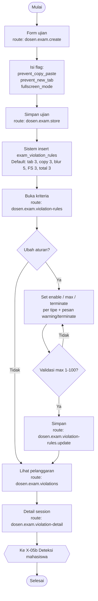

# X-05a — Aturan Anti-Cheat (Dosen)

**Visio page:** `X-05a` — **Basic Flowchart** (satu role: Dosen + Sistem)

Dosen mengatur **apa yang dilarang** dan **kapan ujian dihentikan**. Hasilnya tersimpan di `exams` (flag) dan `exam_violation_rules` (limit).

Pasangan deteksi di browser: [X-05b](X-05b.md).

## Shape mapping

| # | Shape | Label | Route |
|---|-------|-------|-------|
| 1 | Terminator | Mulai | — |
| 2 | Process | Form buat ujian | `dosen.exam.create` |
| 3 | Data | Centang flag anti-cheat | `prevent_copy_paste`, `prevent_new_tab`, `fullscreen_mode` |
| 4 | Process | Simpan ujian | `dosen.exam.store` |
| 5 | Process | Sistem buat aturan default | `ExamViolationRule::getDefaults()` |
| 6 | Process | Buka kriteria pelanggaran | `dosen.exam.violation-rules` |
| 7 | Decision | Ubah aturan? | — |
| 8 | Data | Form: enable / max / terminate per tipe | — |
| 9 | Decision | Validasi max 1–100? | — |
| 10 | Process | Simpan aturan | `dosen.exam.violation-rules.update` |
| 11 | Process | Monitor pelanggaran | `dosen.exam.violations` |
| 12 | Process | Detail session | `dosen.exam.violation-detail` |
| 13 | Terminator | Selesai | — |
| 14 | Off-page | Deteksi mahasiswa | → `X-05b` |

## Mapping aturan → efek

| Yang diatur dosen | Tabel / field | Yang terjadi di mahasiswa (X-05b) |
|-------------------|---------------|-----------------------------------|
| Cegah copy-paste | `exams.prevent_copy_paste` | Listener copy/cut/paste/contextmenu |
| Cegah tab baru | `exams.prevent_new_tab` | `visibilitychange` + `window.blur` |
| Mode fullscreen | `exams.fullscreen_mode` | Wajib fullscreen; `fullscreenchange` |
| Enable tab switch | `enable_tab_switch_detection` | Server abaikan log jika off |
| Max tab switch | `max_tab_switch_count` default 3 | Terminate jika `tab_switch_count` > max dan flag terminate on |
| Enable copy-paste | `enable_copy_paste_detection` | Server abaikan log jika off |
| Max copy-paste | `max_copy_paste_count` default 3 | Sama, pakai `copy_paste_attempt_count` |
| Enable window blur | `enable_window_blur_detection` | Server abaikan log jika off |
| Max window blur | `max_window_blur_count` default 5 | Counter khusus **tidak** diincrement; terminate on limit **default off** |
| Enable fullscreen | `enable_fullscreen_exit_detection` | Server abaikan log jika off |
| Max fullscreen | `max_fullscreen_exit_count` default 3 | Counter khusus **tidak** diincrement; terminate on limit default on |
| Total pelanggaran | `enable_time_based_termination` + `max_violations_before_termination` (3) | `count(violations)` ≥ max → terminate |
| Pesan | `warning_message`, `termination_message` | Modal di `take` |
| Multiple device | `enable_multiple_device_detection` default off | **Belum** ada `violation_type` dari browser |

**Off-page:** [X-05](X-05.md) gabungan swimlane, [X-05b](X-05b.md), [DSN-09a](../dosen/DSN-09a.md), [DSN-09c](../dosen/DSN-09c.md)
