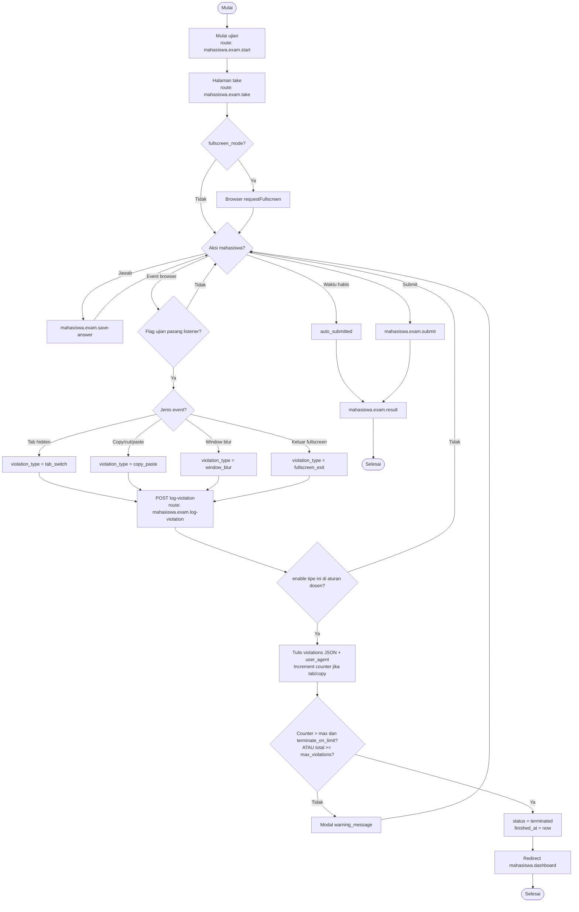

# X-05b — Deteksi Anti-Cheat (Mahasiswa)

**Visio page:** `X-05b` — **Basic Flowchart** (Mahasiswa + browser + server)

Browser di `mahasiswa.exam.take` **mendeteksi peristiwa**, lalu server **menerapkan aturan dosen** (X-05a).

Aturan yang dibaca: flag `exams` + baris `exam_violation_rules`.

## Shape mapping

| # | Shape | Label | Route |
|---|-------|-------|-------|
| 1 | Terminator | Mulai | — |
| 2 | Process | Mulai / lanjut ujian | `mahasiswa.exam.start` |
| 3 | Process | Halaman kerjakan | `mahasiswa.exam.take` |
| 4 | Decision | `fullscreen_mode`? | — |
| 5 | Process | Minta fullscreen | JS `requestFullscreen` |
| 6 | Decision | Event terdeteksi? | — |
| 7 | Decision | Flag ujian mengaktifkan listener? | `prevent_copy_paste` / `prevent_new_tab` / `fullscreen_mode` |
| 8 | Process | Kirim jenis pelanggaran | `mahasiswa.exam.log-violation` |
| 9 | Decision | `enable_*` untuk tipe ini? | `exam_violation_rules` |
| 10 | Process | Catat JSON + counter | `exam_sessions.violations` |
| 11 | Decision | Limit terlampaui? | tipe **atau** total |
| 12 | Process | Modal peringatan | `warning_message` |
| 13 | Process | Terminate session | `status = terminated` |
| 14 | Process | Dashboard | `mahasiswa.dashboard` |
| 15 | Process | Simpan jawaban | `mahasiswa.exam.save-answer` |
| 16 | Process | Submit / auto-submit | `mahasiswa.exam.submit` |
| 17 | Process | Hasil | `mahasiswa.exam.result` |
| 18 | Terminator | Selesai | — |
| 19 | Off-page | Aturan dosen | → `X-05a` |

## Event browser → `violation_type`

Listener hanya dipasang jika flag ujian **on** (X-05a). Server masih bisa menolak log jika `enable_*` **off**.

| Event browser | Syarat flag `exams` | `violation_type` | Counter di session |
|---------------|---------------------|------------------|--------------------|
| `visibilitychange` + `document.hidden` | `prevent_new_tab` | `tab_switch` | `tab_switch_count++` |
| `window.blur` | `prevent_new_tab` | `window_blur` | hanya array JSON |
| copy / cut / paste / contextmenu / Ctrl+C/V/X | `prevent_copy_paste` | `copy_paste` | `copy_paste_attempt_count++` |
| `fullscreenchange` keluar | `fullscreen_mode` | `fullscreen_exit` | hanya array JSON |

Tipe yang **diterima** validasi: `tab_switch`, `copy_paste`, `window_blur`, `fullscreen_exit`.

**Off-page:** [X-05a](X-05a.md) aturan dosen, [X-05](X-05.md) swimlane gabungan, [MHS-12](../mahasiswa/MHS-12.md)
