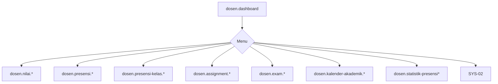

# DSN-00 — Navigasi Dosen

| Menu | Route |
|------|-------|
| Dashboard | `dosen.dashboard` |
| Input Nilai | `dosen.nilai.index` |
| Presensi | `dosen.presensi.index` |
| Presensi Kelas | `dosen.presensi-kelas.index` |
| Tugas | `dosen.assignment.index` |
| Ujian | `dosen.exam.index` |
| Ujian Berlangsung | `dosen.exam.ongoing` |
| Ujian Selesai | `dosen.exam.finished` |
| Pelanggaran | `dosen.exam.all-violations` |
| Kalender | `dosen.kalender-akademik.index` |
| Statistik | `dosen.statistik-presensi.index` |
| Statistik per Prodi | `dosen.statistik-presensi-per-prodi.index` |
| Komunikasi | SYS-02 |

