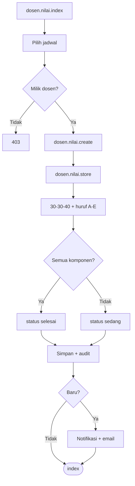

# DSN-02 — Input Nilai

| Shape | Route |
|-------|-------|
| Process | `dosen.nilai.index` |
| Process | `dosen.nilai.create` |
| Process | `dosen.nilai.store` |
| Process | `dosen.nilai.edit` |
| Process | `dosen.nilai.update` |
| Decision | Jadwal milik dosen? |
| Decision | Record baru? → notifikasi |

**Off-page:** [X-03](../cross/X-03.md)
