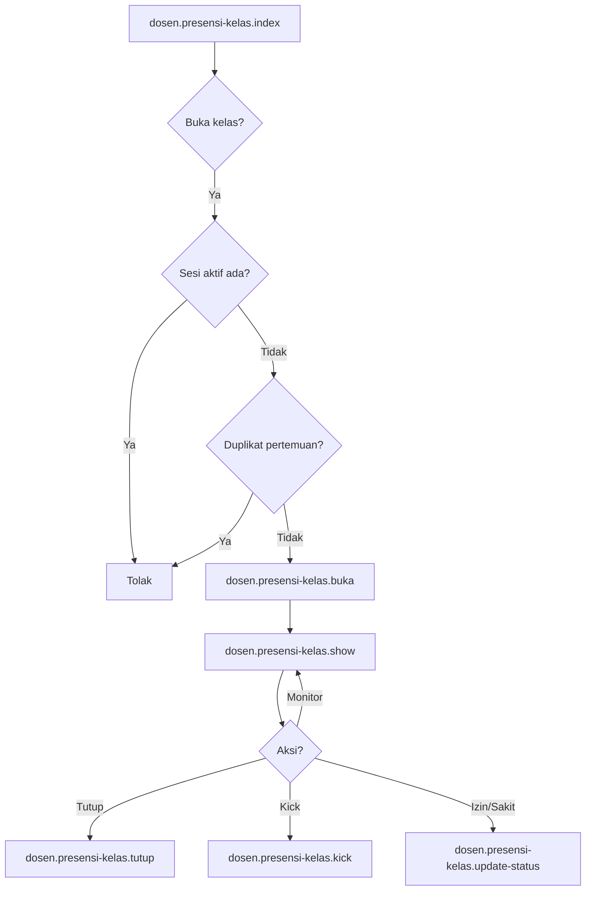

# DSN-04 — Presensi Kelas

| Shape | Route |
|-------|-------|
| Process | `dosen.presensi-kelas.index` |
| Process | `dosen.presensi-kelas.buka` |
| Process | `dosen.presensi-kelas.show` |
| Process | `dosen.presensi-kelas.peserta` |
| Process | `dosen.presensi-kelas.tutup` |
| Process | `dosen.presensi-kelas.kick` |
| Process | `dosen.presensi-kelas.update-status` |

**Off-page:** [X-02](../cross/X-02.md)
