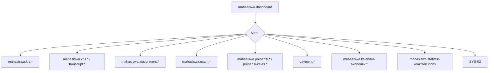

# MHS-00 — Navigasi Mahasiswa

| Menu | Route |
|------|-------|
| Dashboard | `mahasiswa.dashboard` |
| KRS | `mahasiswa.krs.index` |
| KHS | `mahasiswa.khs.index` |
| Transkrip | `mahasiswa.transcript.index` |
| Tugas | `mahasiswa.assignment.index` |
| Ujian | `mahasiswa.exam.index` |
| Presensi | `mahasiswa.presensi.index` |
| Presensi Kelas | `mahasiswa.presensi-kelas.index` |
| Pembayaran | `payment.index` |
| Kalender | `mahasiswa.kalender-akademik.index` |
| Statistik Keaktifan | `mahasiswa.statistik-keaktifan.index` |
| Generate KRS/KHS | `mahasiswa.generate-krs-khs.index` (tidak di sidebar) |
| Komunikasi | SYS-02 |

