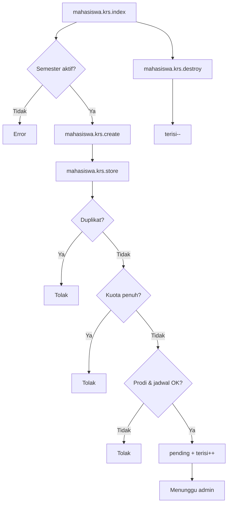

# MHS-02 — KRS

| Shape | Route |
|-------|-------|
| Process | `mahasiswa.krs.index` |
| Process | `mahasiswa.krs.create` |
| Process | `mahasiswa.krs.store` |
| Process | `mahasiswa.krs.destroy` |
| Decision | Semester aktif? |
| Decision | Sudah di KRS? / Kuota? / Prodi OK? |

**Off-page:** [X-01](../cross/X-01.md)
