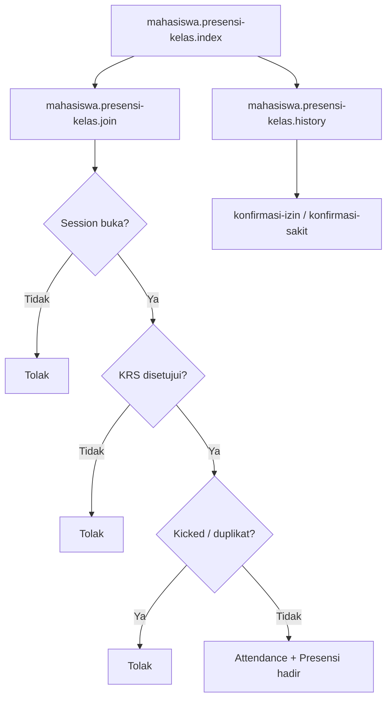

# MHS-08 — Presensi Kelas

| Shape | Route |
|-------|-------|
| Process | `mahasiswa.presensi-kelas.index` |
| Process | `mahasiswa.presensi-kelas.join` |
| Process | `mahasiswa.presensi-kelas.history` |
| Process | `mahasiswa.presensi-kelas.konfirmasi-izin` |
| Process | `mahasiswa.presensi-kelas.konfirmasi-sakit` |

**Off-page:** [X-02](../cross/X-02.md)
