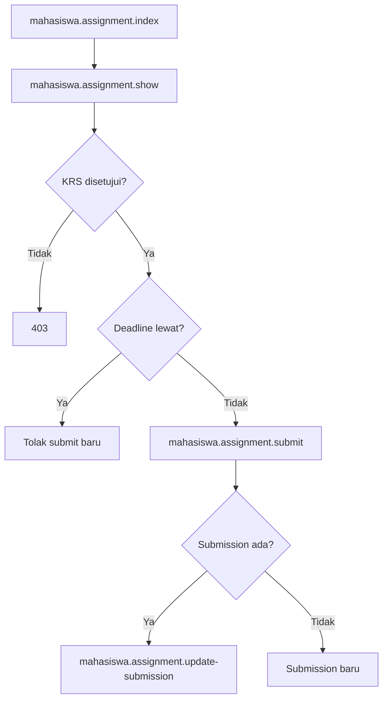

# MHS-11 — Tugas

| Shape | Route |
|-------|-------|
| Process | `mahasiswa.assignment.index` |
| Process | `mahasiswa.assignment.show` |
| Process | `mahasiswa.assignment.submit` |
| Process | `mahasiswa.assignment.update-submission` |
| Process | `mahasiswa.assignment.download` |
| Decision | KRS disetujui? |
| Decision | Lewat deadline? |
| Decision | Sudah ada submission? |

