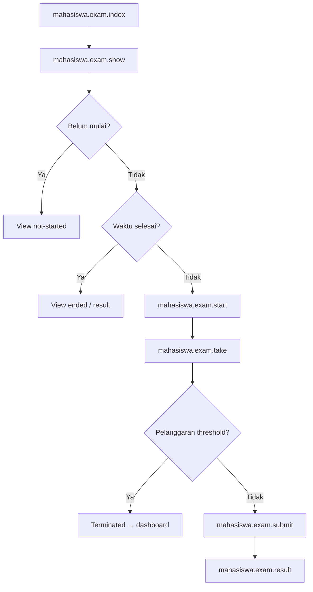

# MHS-12 — Ujian

| Shape | Route |
|-------|-------|
| Process | `mahasiswa.exam.index` |
| Process | `mahasiswa.exam.show` |
| Process | `mahasiswa.exam.start` |
| Process | `mahasiswa.exam.take` |
| Process | `mahasiswa.exam.save-answer` |
| Process | `mahasiswa.exam.submit` |
| Process | `mahasiswa.exam.log-violation` |
| Process | `mahasiswa.exam.result` |

**Process:** `mahasiswa.exam.log-violation` pada tab switch, copy, blur, fullscreen exit.

**Off-page:** [X-05b](../cross/X-05b.md) deteksi mahasiswa, [X-05](../cross/X-05.md) swimlane.
