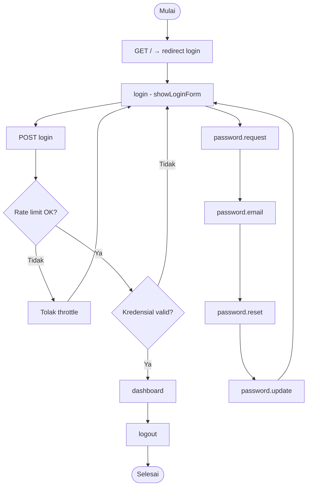

# SYS-00 — Login, Logout, Reset Password

**Visio page:** `SYS-00`

## Shape mapping

| Shape | Label | Route / URL |
|-------|-------|-------------|
| Terminator | Mulai | `GET /` → redirect |
| Process | Halaman login | `login` → `GET /login` |
| Process | Submit login | `POST /login` (throttle 5/min) |
| Decision | Rate limit OK? | middleware `throttle:5,1` |
| Decision | Kredensial valid? | `LoginController@login` |
| Process | Redirect dashboard | `dashboard` → `GET /dashboard` |
| Process | Logout | `logout` → `POST /logout` |
| Process | Lupa password form | `password.request` |
| Process | Kirim email reset | `password.email` |
| Process | Form reset token | `password.reset` |
| Process | Simpan password baru | `password.update` |
| Terminator | Selesai | — |

**Off-page:** Lanjut ke [SYS-01](SYS-01.md) setelah login sukses.
