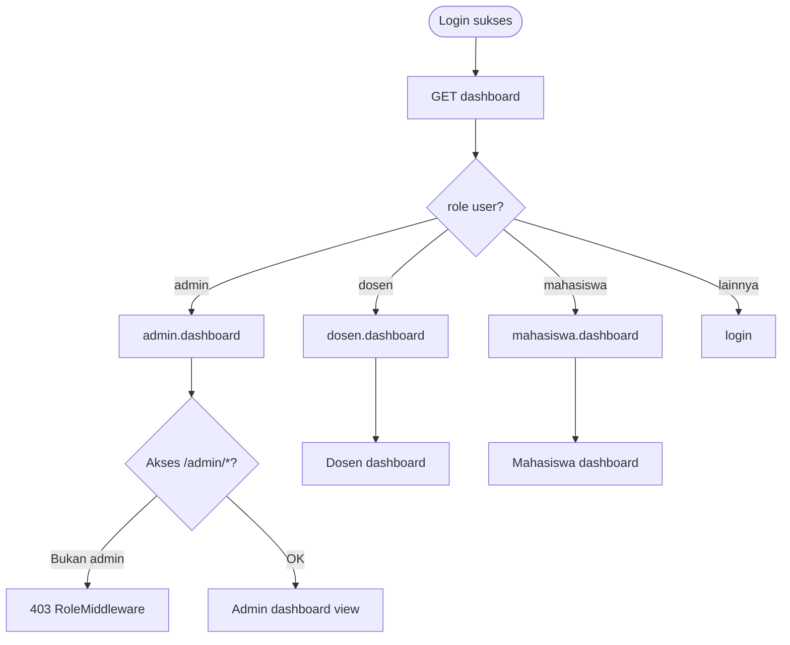

# SYS-01 — Dashboard Redirect per Role

**Visio page:** `SYS-01`

## Shape mapping

| Shape | Label | Route |
|-------|-------|-------|
| Terminator | Mulai (setelah login) | — |
| Process | Akses dashboard | `dashboard` |
| Decision | Role user? | `auth()->user()->role` |
| Process | Redirect admin | `admin.dashboard` |
| Process | Redirect dosen | `dosen.dashboard` |
| Process | Redirect mahasiswa | `mahasiswa.dashboard` |
| Process | Redirect login | `login` (default) |
| Decision | Middleware role | `role:admin` / `dosen` / `mahasiswa` |
| Process | 403 Forbidden | RoleMiddleware |
| Terminator | Selesai | — |

**Off-page:** ADM-00, DSN-00, MHS-00
