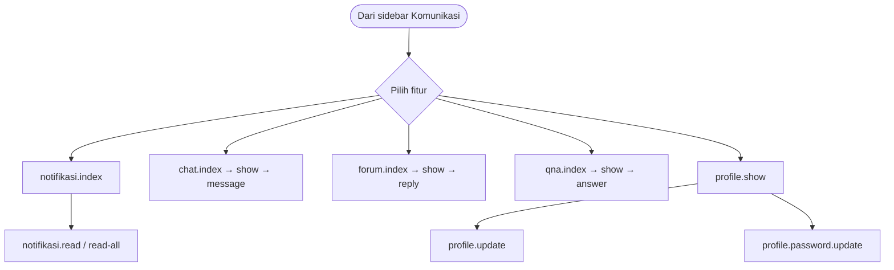

# SYS-02 — Komunikasi & Profil (Semua Role)

**Visio page:** `SYS-02`

## Notifikasi

| Shape | Route |
|-------|-------|
| Process | `notifikasi.index` |
| Process | `notifikasi.read` |
| Process | `notifikasi.read-all` |
| Process | `notifikasi.unread-count` (AJAX) |
| Process | `notifikasi.recent` (AJAX) |

## Chat

| Shape | Route |
|-------|-------|
| Process | `chat.index` |
| Process | `chat.create` |
| Process | `chat.store` |
| Process | `chat.show` |
| Process | `chat.message` |

## Forum

| Shape | Route |
|-------|-------|
| Process | `forum.index` |
| Process | `forum.create` |
| Process | `forum.store` |
| Process | `forum.show` |
| Process | `forum.reply` |

## Q&A

| Shape | Route |
|-------|-------|
| Process | `qna.index` |
| Process | `qna.create` |
| Process | `qna.store` |
| Process | `qna.show` |
| Process | `qna.answer` |
| Process | `qna.best-answer` |

## Profil

| Shape | Route |
|-------|-------|
| Process | `profile.show` |
| Process | `profile.update` |
| Process | `profile.password.update` |

